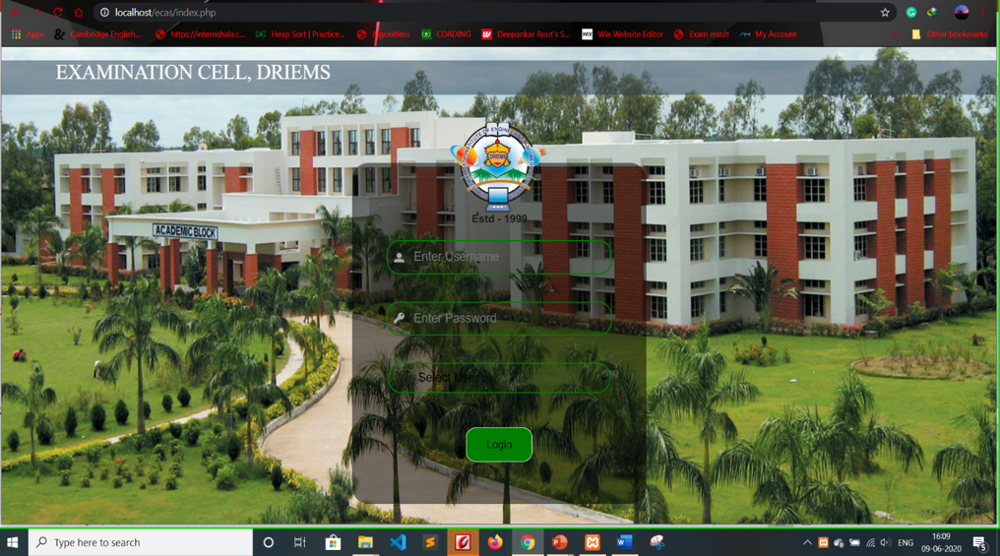
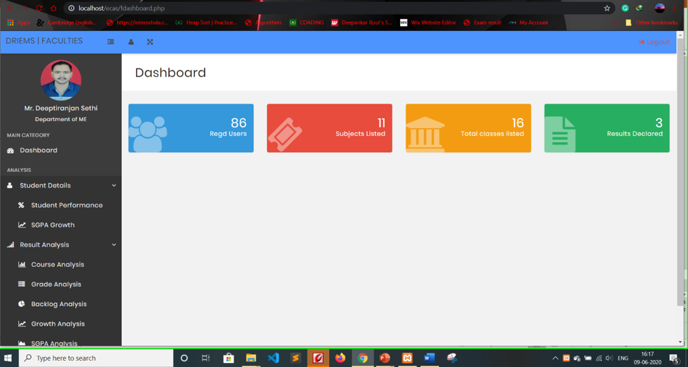
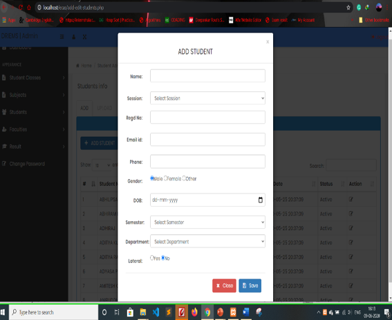
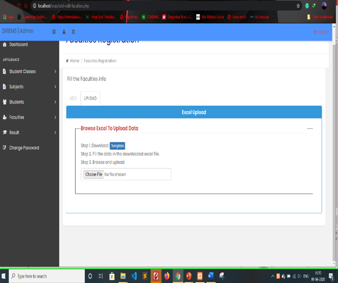
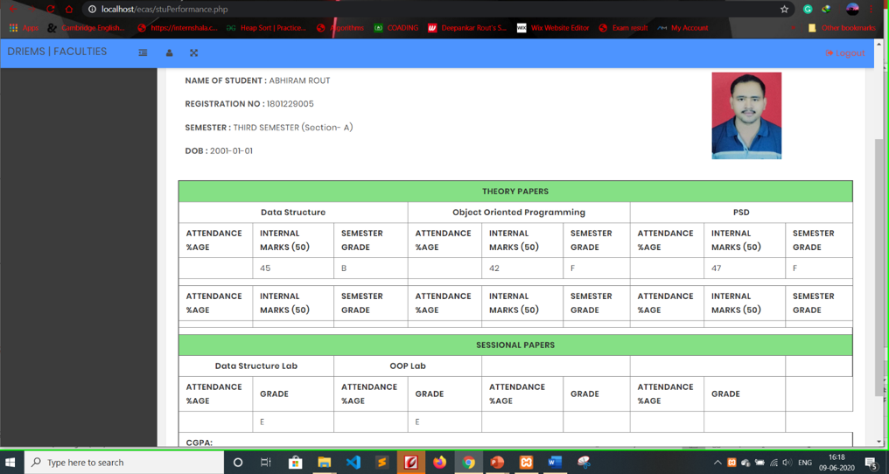
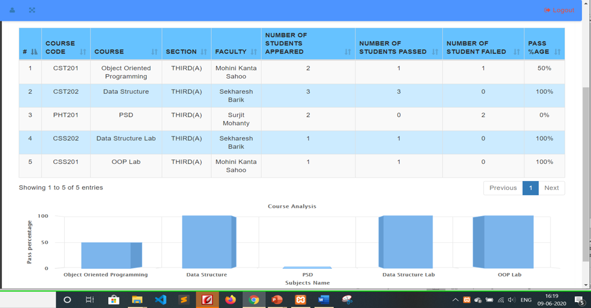
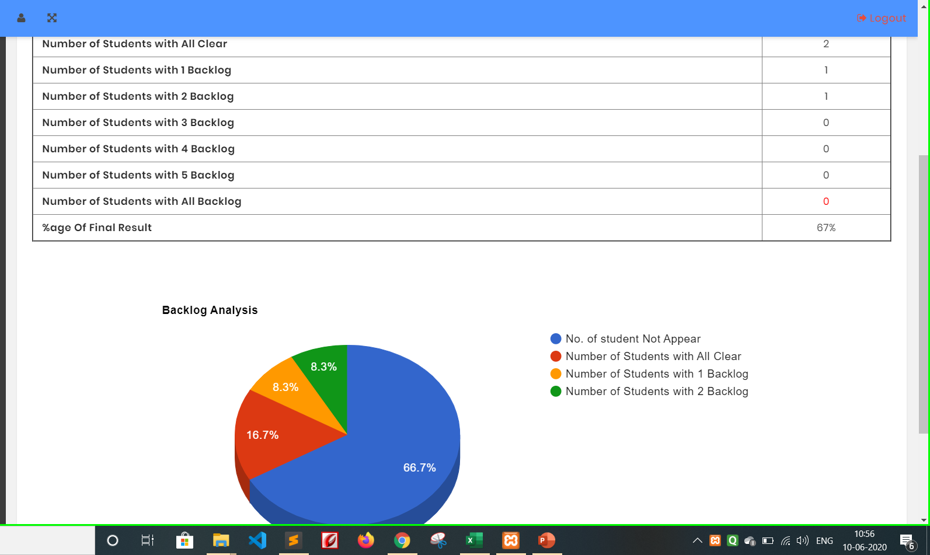

# Examination Automation System Project
This project was bootstrapped with [PHP](https://www.php.net/docs.php) & [jQuery](https://jquery.com/).

Below you will find some information on how to perform common tasks.<br>

## Table of Contents
- [About](#about)
- [Local Setup](#local-setup)
- [Folder Structure](#folder-structure)
- [How To Run](#how-to-run)
- [Snapshots](#snapshots)


## About

It is an automation application with gorgeous interface and fully basic function. 
- Author: [Deepankar Rout](https://github.com/deepankarrout) & [Deepti Ranjan Sethi](#).
- Language: Html, CSS, javascript, jQuery for Front-end and PHP for Back-end.

## Local Setup

- Install XAMPP with PHP version ^7.0
- Move project folder to XAMPP/htdocs.

## Folder Structure
- Go to project folder, folder structure looks like same as below.

```
    > Classes/
    > css/
    > fonts/
    > images/
    > includes/
    > js/
    > sass/
    > supload/
    > upload/
    index.php
    logout.php
    .
    .
    .
```
- For the project to run, **these files must exist with exact filenames**:

    * `index.php` is the login page, for login to the project and access all features.
    * `includes/` all common required files are available here.
        * `config.php` is the DB connection file.
        * `leftbr.php` and `topbr.php` as name suggests used for project left and top common structure.
    
- You can delete or rename the other files according to your requirement.

- You need to **put any JS and CSS files inside `js/` and `css/` respectively**.

- `images/` folder used for storing images which is used in our projects.

## How To Run
- To run project on your local server open browser and hit localhost or 127.0.0.1 with port 8080 (default port for xampp server) with project folder name. (i.e like localhost:8080/Exam-Cell-Automation-System)

- Now project index page will show to you which is login page of your project.

## Snapshots

<p align="center"></p>
<p align="center"></p>
<p align="center"></p>
<p align="center"></p>
<p align="center"></p>
<p align="center"></p>
<p align="center"></p>

## <p align="center"> Thank You ✌</p>